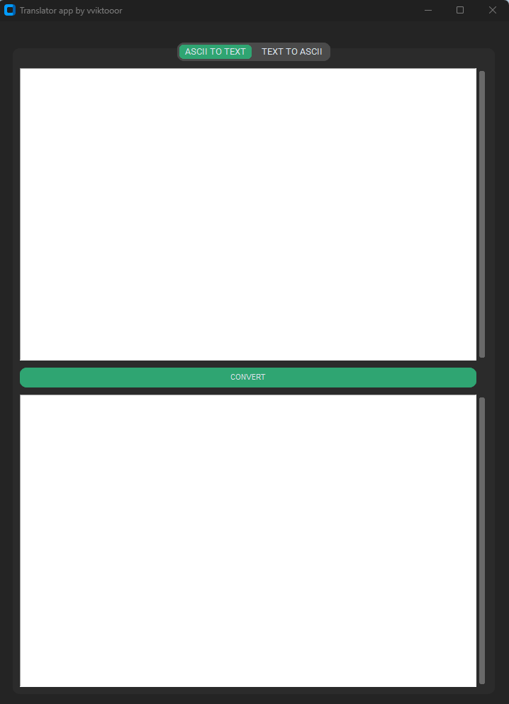

# Ascii-Translator 🚀

This program is a simple text to ascii or ascii to text translator. 


## Installation

This project requires internet connection to install all the modules. You can download them manually or with requirements.txt

```terminal
  cd Ascii-Translator
```
```terminal
  pip3 install -r requirements.txt
```
    
## Usage/Examples

After successful installation, run operations. py. You can see two text boxes in the first write your input depending on the selected tab "ASCII TO TEXT" or "TEXT TO ASCII". At the bottom, the converted data will appear when you click the convert button.
## Screenshots




## Features

- Dark mode
- Fullscreen mode
- App is fully resizable

